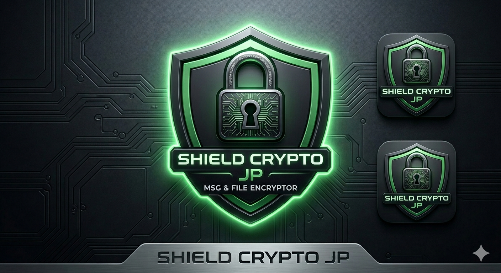
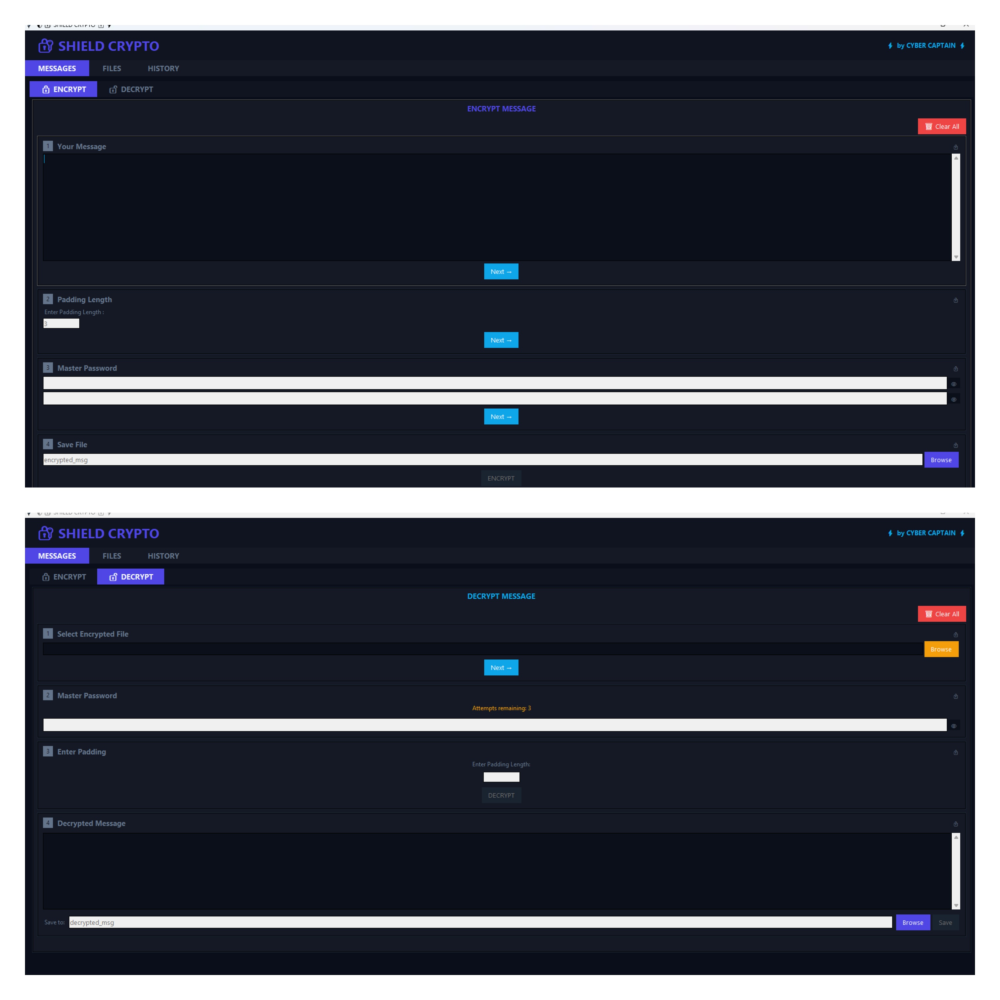
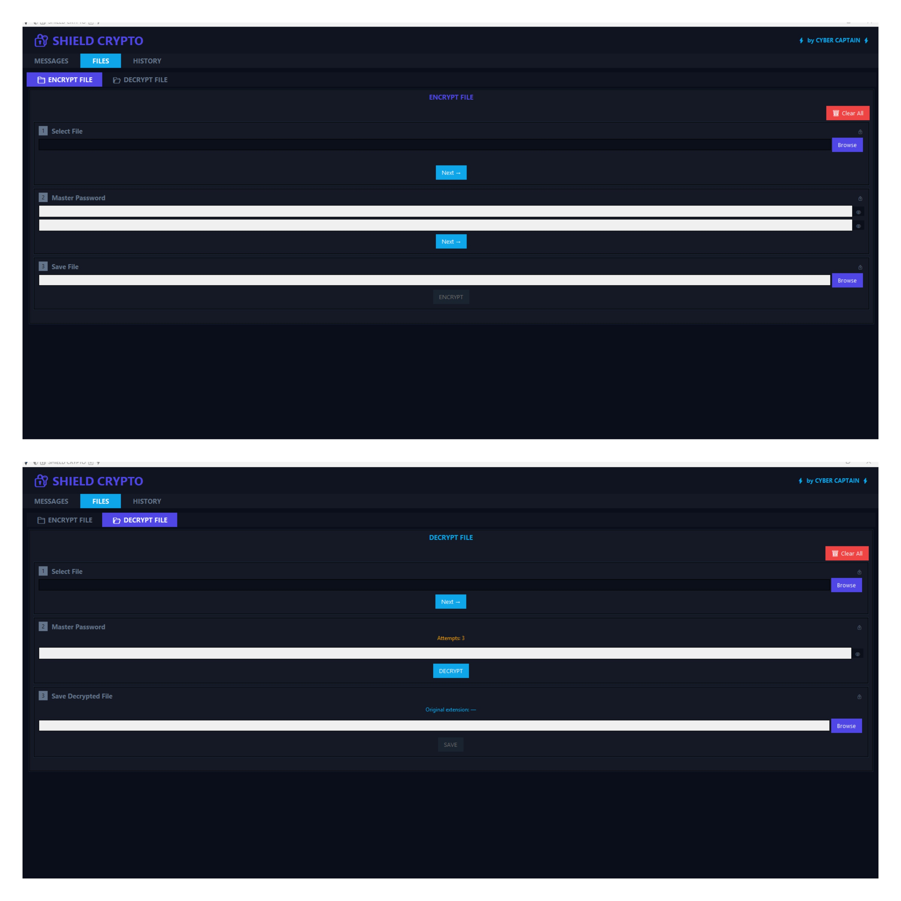
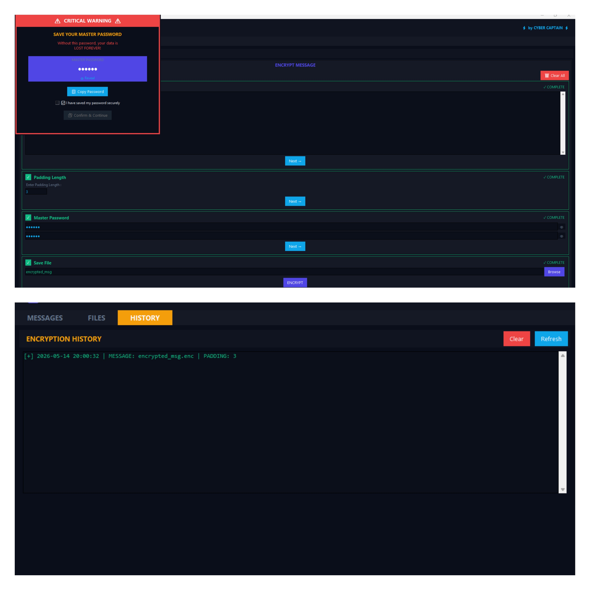

# 🔐 ShieldCrypto

<div align="center">



[](https://github.com/the-cybercaptain/shield-crypto/stargazers)

[](https://github.com/the-cybercaptain/shield-crypto/network)

[](https://github.com/the-cybercaptain/shield-crypto/issues)

[](LICENSE)

**A powerful, enterprise-grade Desktop Encryption Application written in Python Tkinter. Implements AES-GCM + ChaCha20-Poly1305 double encryption for secure messaging, binary file protection, and automated password-salted auditing. 🛡️💻**

</div>

## 📖 Overview

ShieldCrypto is a robust desktop application designed to provide top-tier data security through advanced encryption techniques. Built with Python and Tkinter, it offers a user-friendly graphical interface for encrypting and decrypting sensitive text messages and binary files. Beyond basic encryption, ShieldCrypto incorporates a unique password-salted auditing feature, enhancing the integrity and traceability of protected data, making it suitable for both personal and enterprise-level security needs.

## ✨ Features

-   **Robust Double Encryption**: Utilizes a formidable combination of AES-256-GCM and ChaCha20-Poly1305 for unparalleled data security, ensuring confidentiality and authenticity.
-   **Secure Message Exchange**: Encrypt and decrypt text messages directly within the application, guaranteeing private and secure communication.
-   **Comprehensive File Protection**: Encrypts and decrypts various binary file types (documents, images, executables, etc.), safeguarding sensitive information on your desktop.
-   **Automated Password-Salted Auditing**: Implements an advanced auditing mechanism, leveraging `pefile` for deep analysis of protected files, enhancing integrity, and providing traceability for security-conscious users.
-   **Intuitive Desktop Interface**: Powered by Python Tkinter with `ttkbootstrap` for a modern, responsive, and user-friendly graphical experience across different operating systems.
-   **Operation History**: Tracks and displays a detailed history of all encryption and decryption activities, allowing users to review past operations and maintain an audit trail.
-   **Password-Based Key Derivation**: Securely derives encryption keys from user-provided passwords using robust KDFs.

## 🖥️ Screenshots

| 💬 Message Encryption | 📁 File Protection | 📜 Audit History |
|-------------------|-----------------|---------------|
|  |  |  |

## 🛠️ Tech Stack

     

## 🚀 Quick Start

Follow these steps to get ShieldCrypto up and running on your local machine.

### Prerequisites

-   **Python 3.x** (Python 3.8+ is recommended)

### Installation

1.  **Clone the repository**
    ```bash
    git clone https://github.com/the-cybercaptain/shield-crypto.git
    cd shield-crypto
    ```

2.  **Install dependencies**
    ShieldCrypto uses `pip` to manage its Python dependencies.
    ```bash
    pip install -r requirements.txt
    ```

3.  **Run the application**
    Once all dependencies are installed, you can launch the application:
    ```bash
    python main.py
    ```

The ShieldCrypto desktop application window will open, ready for use.

## 📁 Project Structure

```
shield-crypto/
├── LICENSE                 # Project license file
├── README.md               # This README file
├── ShieldCrypto.png        # Main application logo/screenshot
├── core_code.py            # Contains core encryption/decryption logic and utilities
├── file_tab.py             # GUI module for the file encryption/decryption tab
├── history_tab.py          # GUI module for displaying operation history and auditing
├── main.py                 # Main entry point for the application, initializes the GUI
├── message_tab.py          # GUI module for the text message encryption/decryption tab
├── requirements.txt        # Lists all Python dependencies
├── screenshots/            # Directory to store additional application screenshots
└── ui_components.py        # Reusable Tkinter custom UI widgets and styles
```

## ⚙️ Configuration

ShieldCrypto is primarily configured through its graphical user interface. Key settings, such as passwords for encryption, are handled directly within the application's UI. There are no external configuration files (`.env`, `.ini`, etc.) to modify directly.

## 🔧 Development

To contribute or further develop ShieldCrypto, simply follow the installation steps and run the application from `main.py`. Modifications to the `.py` files will be reflected upon restarting the application.

### Available Scripts

-   `python main.py`: Starts the ShieldCrypto desktop application.

## 🤝 Contributing

We welcome contributions to ShieldCrypto! If you have suggestions for improvements, bug reports, or would like to add new features, please feel free to:

1.  Fork the repository.
2.  Create a new branch (`git checkout -b feature/AmazingFeature`).
3.  Commit your changes (`git commit -m 'Add some AmazingFeature'`).
4.  Push to the branch (`git push origin feature/AmazingFeature`).
5.  Open a Pull Request.

Please ensure your code adheres to Python best practices and includes appropriate comments.

## 📄 License

This project is licensed under the [MIT License](LICENSE) - see the LICENSE file for details.

## 🙏 Acknowledgments

-   **Cryptography Library**: For providing robust and secure cryptographic primitives.
-   **Pillow (PIL Fork)**: For image processing capabilities within the UI.
-   **ttkbootstrap**: For enhancing the Tkinter user interface with modern styling.
-   **PEfile**: For enabling Portable Executable file parsing and auditing features.

## 📞 Support & Contact

-   🐛 Issues: Feel free to report any bugs or suggest features on the [GitHub Issues page](https://github.com/the-cybercaptain/shield-crypto/issues).
---

<div align="center">

**⭐ Star this repo if you find it helpful!**

Made with ❤️ by [the-cybercaptain](https://github.com/the-cybercaptain)

</div>

